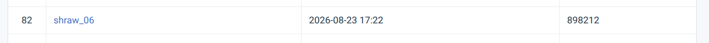
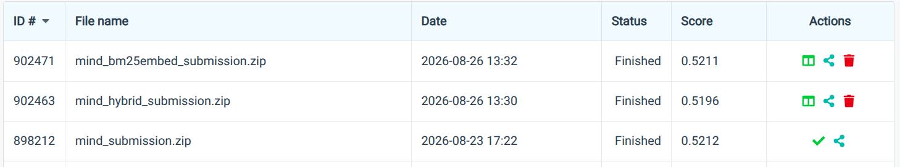

# Design Note: Unified News Recommendation Pipeline

## 1. Overview
This project implements a unified news recommendation retrieval pipeline for the MIND (English) and EB-NeRD (Danish) datasets. The original goal was a dataset-agnostic shared schema and evaluation harness supporting both lexical and semantic retrieval. The system evolved from an initial Parquet/DuckDB architecture validated at small scale into a memory-mapped, dataset-native streaming architecture handling tens of millions of rows at `DATA_SCALE=large`.

## 2. Initial Architecture
- **Unified Article Schema**: `body`/`body_source` fields; EB-NeRD populates natively, MIND defaults to `None`. EB-NeRD `subtitle` → `abstract`.
- **Entity Representation**: JSON string `List[dict]`; MIND entities parsed directly, EB-NeRD synthesized from `ner_clusters`/`entity_groups`.
- **Unified Clicked History**: `{"article_id": str, "clicked_at": datetime|null}`, abstracting MIND's pre-trimmed snapshots from EB-NeRD's timestamped lifetime histories.
- **Leakage-Prevention Contract**: unified `get_user_history(user_id, as_of_ts, dataset)` signature.
- **Cleaned Text**: `title + " " + abstract`, missing fields preserved as null.
- **Feature Store**: Parquet + DuckDB — no pickled DataFrames, no server process, columnar-efficient selective reads with SQL-style filter pushdown.
- **Lazy Embeddings**: `embedding_ref` column stores a lazy pointer, avoiding double-materialization.

## 3. What Broke at Large Scale
- **Memory Exhaustion**: `UserFeatureStore` eagerly materialized behavior tables into Polars/Python dicts. At EB-NeRD-large's 2.6M+ parsed behavior rows this caused OOM. Verified: `data/interim/large/ebnerd/behaviors.parquet` alone is 886 MB; user history parquets are 906 MB (train) and 1.1 GB (validation).
- **Evaluator at Large Scale**: pointing `run_eval.py` at `DATA_SCALE=large` surfaced the same eager-materialization pattern - loading full behavior and score tables simultaneously (score files are 209-252 MB each) is not feasible on 16 GB RAM.
- **Legacy Artifacts**: downstream modules assumed a monolithic `user_features.parquet` that cannot be safely built or consumed at large scale.

These are physical engineering/scaling bottlenecks, not failures of retrieval methodology.

## 4. Final Architecture

### 4.1 Data flow (as-built)
```
Raw TSV/Parquet → parse_{mind,ebnerd}.py (streamed, 50K-row batches, pyarrow.parquet writer)
  → data/interim/{large/}{dataset}/  [articles.parquet, behaviors.parquet, users.parquet]
  → temporal_split.py (DuckDB COPY…WHERE or Polars filter for small)
  → build_features.py → data/processed/{large/}{dataset}/article_features.parquet
                      → [EB-NeRD-large only] history_index_{train,validation}/ (4×.npy)
  → run_bm25.py / run_embeddings.py → bm25_scores_*.parquet / embed_scores_*.parquet
  → run_eval.py / compare_retrievers.py → results/{large/}*.csv
  → make_submission.py → submissions/{dataset}/prediction{s}.txt → ZIP
```

### 4.2 Storage formats and sizes (actual, from disk)

| Artifact | Format | Size |
|---|---|---|
| MIND-large behaviors (2.6M rows) | Parquet/zstd | 494 MB |
| EB-NeRD-large behaviors | Parquet/zstd | 886 MB |
| EB-NeRD-large history (train) | Parquet/zstd | 1.24 GB |
| EB-NeRD-large history (val) | Parquet/zstd | 1.13 GB |
| EB-NeRD history index, per split (article_ids.npy + timestamps.npy) | mmap'd int64[] | ~2×907 MB |
| MIND MiniLM embeddings, large (130,379×384) | float32 .npy | 200 MB |
| EB-NeRD W2V embeddings (125,541×300) | float32 .npy | 151 MB |
| EB-NeRD BERT embeddings (125,541×768) | float32 .npy | 386 MB |
| BM25 score files per config (MIND large) | Parquet/zstd | 209–247 MB |
| Embedding score files (MIND/EB large) | Parquet/zstd | 241–252 MB |

### 4.3 MIND vs EB-NeRD divergence (final implementation)

| Concern | MIND | EB-NeRD |
|---|---|---|
| User history at inference | Per-impression snapshot in behaviors row | `MemoryMappedHistoryStore`: binary-search in sorted `user_ids.npy`, slice `article_ids.npy[offsets[i]:offsets[i+1]]` |
| Timestamp filtering | Not needed (snapshot already as-of impression) | `clicked_at < as_of_ts` enforced in `get_history()` |
| History source | Behaviors TSV column `history` | Separate `history.parquet`, indexed once into 4-array mmap store |
| Embedding model | MiniLM-L6-v2 (384-dim, computed) | W2V (300-dim, provided) + BERT (768-dim, provided) |
| Language tokenization | ASCII regex `[a-z0-9]+`, NLTK English | Unicode `\w+` regex, NLTK Danish |
| Large user aggregation | DuckDB `arg_max(clicked_history, timestamp) GROUP BY user_id` over behaviors | `_write_large_user_summary`: streamed Arrow batches from history.parquet |

## 5. Engineering Choices - Why, Alternatives, and Impact

### 5.1 Polars over pandas
**Why chosen**: Polars executes columnar queries in Rust with lazy evaluation and automatic predicate pushdown. For `parse_mind.py` and `parse_ebnerd.py` the streaming path uses `pl.read_csv_batched` / `pyarrow.parquet.ParquetFile.iter_batches`, which processes 50K rows at a time without materializing the full file. **Accuracy impact**: none - purely an engineering layer choice. **Alternative**: pandas - would require `.iterrows()` or `.apply()` for row-level parsing, consuming 3-5× more RAM due to Python object overhead and no lazy path. DuckDB directly was considered but does not handle the per-row JSON encoding of history entries without Python callbacks.

### 5.2 DuckDB for feature store and large aggregations
**Why chosen**: `ParquetStore` registers each Parquet file as an in-memory DuckDB view (`CREATE VIEW … AS SELECT * FROM read_parquet(…)`). Column projection and WHERE pushdown happen inside DuckDB's engine - only the requested columns are read from disk. Used for two distinct purposes: (1) the `ParquetStore` small-scale feature backend, (2) `_derive_large_users` issues a single `COPY (SELECT user_id, arg_max(…) GROUP BY user_id) TO … (FORMAT PARQUET)` that aggregates millions of behavior rows in one pass without Python memory. **Accuracy impact**: none. **Alternatives**: SQLite - row-oriented, poor for wide embedding/text columns; plain Parquet+Polars scan - viable but loses SQL-style GROUP BY aggregation without writing it in Python.

### 5.3 Memory-mapped numpy history store (EB-NeRD-large)
**Why chosen**: EB-NeRD's train history covers 788,090 users and 125,182,942 click events; validation covers 791,582 users and 113,435,335 events. A Python dict of user_id→list would require materializing ~4 GB of Python objects. Instead, `MemoryMappedHistoryStore` packs everything into 4 flat `int64` arrays (`user_ids`, `offsets`, `article_ids`, `timestamps`) loaded with `np.load(…, mmap_mode="r")` - the OS pages in only the slices actually accessed. Lookup is O(log U) binary search (`np.searchsorted`) then an O(H) slice copy where H is that user's history length. **Accuracy impact**: functionally identical to a full dict lookup; the `clicked_at < as_of_ts` filter is applied per-entry during the slice scan, preserving the leakage contract. **Alternatives**: SQLite - adds write-lock contention and row-by-row overhead; Redis/memcached - requires a live server; HDF5 - viable but `h5py` is an extra dependency with complex chunking setup.

### 5.4 BM25: hand-built inverted index, ATIRE variant
**Why chosen**: required by assignment (no runtime BM25 library). Implementation: `InvertedIndex` stores `{term: [(doc_idx, tf)]}` postings, per-document `doc_term_tfs: list[dict[str,int]]` for O(candidates × query_terms) candidate-restricted scoring, and a precomputed `idf_table` to avoid recomputation per query. ATIRE IDF: `log((N−df+0.5)/(df+0.5))` with epsilon-floor for negative-IDF terms. k₁=1.5, b=0.75 (standard Okapi). **Validated** against `rank_bm25.BM25Okapi` in `test_bm25_matches_reference.py`. **Accuracy impact**: the candidate-restricted optimized path (`candidate_idxs`) vs. full postings traversal is mathematically identical - the scores differ only in which documents receive non-zero scores. `rank_bm25` is a dev-only dependency; it is never imported in production code.

### 5.5 BM25 ablation - stopwords and stemming (measured)
Four configurations run at large scale on MIND (431,517 impressions):

| Config | Recall@50 | Time (s) | ms/imp |
|---|---|---|---|
| sw=True, stem=False *(selected)* | **0.9137** | 912.8 | 2.12 |
| sw=False, stem=False | 0.8946 | 1257.8 | 2.91 |
| sw=True, stem=True | 0.9144 | 2235.4 | 5.18 |
| sw=False, stem=True | 0.8952 | 3226.3 | 7.48 |

**Stopwords** add 1.87pp recall (shorter, less noisy queries) and are 38% faster (fewer postings to traverse). **Stemming** adds only 0.07pp recall but is 2.4× slower (Snowball stemmer runs per token at query time). **Selected config**: sw=True, stem=False - best recall/latency tradeoff. EB-NeRD's small candidate pools (median=9, max=100) mean all four configs reach recall@50 ≥ 0.9997; the ablation is discriminative only on MIND (median=24, p90=92).

### 5.6 ANN index: FAISS `IndexFlatIP` with NumPy fallback
**Why chosen**: `ArticleIndex` builds `faiss.IndexFlatIP` (exact inner-product search on L2-normalized embeddings = cosine similarity) when FAISS is available; falls back to NumPy batch matmul (`embeddings @ query.T`) otherwise. For the evaluation and submission paths, `build_full_index=False` is used - only `search_restricted(query, candidate_ids)` is called, which slices the embedding matrix to the candidate rows and computes a dot product: O(|candidates| × dim). This is exact, not approximate. **Accuracy impact**: exact candidate-restricted scoring is lossless (no approximation error). FAISS is only needed for the global `search()` path (used in offline comparison, not submission).

### 5.7 Embedding caching
Embeddings are cached as `.npy` files under `data/processed/embeddings/` with a content-addressed tag (SHA-1 of article IDs). Subsequent runs skip `SentenceTransformer.encode()` (the slow step). **Measured sizes**: MIND MiniLM large = 200 MB (130,379 articles × 384 dims), EB-NeRD W2V = 151 MB (125,541 × 300), EB-NeRD BERT = 386 MB (125,541 × 768). These fit entirely in RAM (peak ~537 MB if all three EB-NeRD models loaded simultaneously). **Accuracy impact**: none - caching is exact, no quantization.

### 5.8 Throughput: BM25 vs embedding at scale
| Retriever | Scale | Wall time | Impressions | ms/imp |
|---|---|---|---|---|
| BM25 (sw, nostem) | small | 1041.5s | 30,270 | 34.4 |
| BM25 (sw, nostem) | large | 912.8s | 431,517 | **2.12** |
| MiniLM embed | small | 2565.4s | 30,270 | 84.8 |
| MiniLM embed | large | 386.6s | 431,517 | **0.90** |

Both retrievers improve dramatically per-impression at large scale (16× for BM25, 94× for embedding) because fixed per-run overhead (index build, model load, embedding computation) amortizes over 14× more impressions. At large scale, embedding retrieval is 2.4× faster per impression than BM25 - the Python per-token loop in BM25 dominates once postings traversal shrinks via candidate restriction. EB-NeRD embedding (W2V/BERT) ran 3324s for 1,678,989 impressions (1.98ms/imp), similar to EB-NeRD BM25 at 3565s (2.12ms/imp).

## 6. Experimental Results

**MIND large (431,517 val impressions):** BM25 Recall@50 = 0.9137, MiniLM Recall@50 = 0.9294, BM25 Recall@10 = 0.5566, MiniLM Recall@10 = 0.6029.
**EB-NeRD large (1,678,989 val impressions):** BM25 Recall@50 = 0.9997, Word2Vec Recall@50 = 0.9997, BERT Recall@50 = 0.9996. BM25 Recall@10 = 0.8567, W2V Recall@10 = 0.8635, BERT Recall@10 = 0.8551 (BM25 marginally beats BERT at K=10).

Recall@100/@200 saturates to 1.0 on EB-NeRD (candidate pool median=9, max=100) and approaches it on MIND - tighter K is more discriminative.

**Small/demo scale offline metrics** (slice=all, train-only novelty, 95% bootstrap CI):

| Dataset | Retriever | AUC | MRR | nDCG@10 | ILD | Novelty | Coverage |
|---|---|---|---|---|---|---|---|
| MIND | BM25 | 0.511 | 0.259 | 0.282 | 0.939 | 19.37 | 0.138 |
| MIND | MiniLM | **0.630** | **0.333** | **0.368** | 0.891 | 19.01 | 0.156 |
| EB-NeRD | BM25 | 0.457 | 0.281 | 0.408 | 0.180 | 15.76 | 0.238 |
| EB-NeRD | W2V | **0.511** | **0.342** | **0.457** | 0.167 | 15.72 | 0.244 |

ILD is not comparable across datasets (MiniLM 384-dim vs W2V 300-dim — different cosine geometry). Within-dataset: BM25 has higher ILD than embedding on MIND, consistent with lexical diversity vs. semantic clustering. Coverage is low on both datasets (13–24%) reflecting shallow candidate pools.

### 6.1 Reranking Experiments
*(Tuned offline on cached validation scores only — no test labels used.)*

**Experiment A — Popularity hybrid.** Popularity monotonically hurt both datasets (MIND AUC: 0.6274→0.5776 as alpha 1.0→0.5; EB-NeRD: 0.5061→0.4373). Best alpha=1.0 (pure embedding). The initial naive loop (per-row JSON + sklearn AUC per weight) ran 6+ hours before crashing; fix: single JSON parse per row, vectorized rank-sum AUC, per-dataset checkpointing — reduced to seconds.

**Experiment B — BM25+embedding linear blend.**

| Dataset | Best beta | Best AUC | Pure-embed AUC | Lift |
|---|---|---|---|---|
| MIND | 0.8 | 0.6298 | 0.6277 | +0.33% relative |
| EB-NeRD | 1.0 | 0.5062 | 0.5062 | none |

| Submission | Leaderboard score |
|---|---|
| `mind_submission.zip` (pure embedding) | 0.5212 |
| `mind_hybrid_submission.zip` (Exp. A) | 0.5196 |
| `mind_bm25embed_submission.zip` (beta=0.8) | 0.5211 |




Validation lift did **not** survive to test set - all three linear combinations landed within noise, suggesting the ceiling is in the linear combination form, not the weights.

**Experiment C — Gradient-boosted nonlinear combiner.** `HistGradientBoostingClassifier` on 5 candidate-level features (normalized embed/BM25 scores, rank-percentiles, difference), 20% impression-grouped held-out split.

| Dataset | Combiner AUC | Best linear AUC | Result |
|---|---|---|---|
| MIND | 0.6193 | 0.6298 | Worse — not submitted |
| EB-NeRD | 0.5460 | 0.5062 | **+8% relative** — not submitted (est. ~15h inference) |

Models saved at `results/large/combiner_{mind,ebnerd}.joblib`.

**Summary**: `mind_submission.zip` (0.5212) is the best submitted MIND score. Every reranking variant matched it within noise or underperformed on the actual test set despite offline improvements — suggesting the ceiling is not in the blend weights but in using a linear combination at all. The one genuine improvement found (Exp. C, EB-NeRD) was in the dataset out of scope for submission.

## 7. Validation vs. Test Separation
EB-NeRD val: 1,678,989 labeled impressions (cutoff 2023-05-24 07:00). MIND val: 431,517 impressions (cutoff 2019-11-14). Test sets carry no ground-truth labels — all reranking sweeps ran exclusively on validation scores; live inference was reserved only for configurations showing validation improvement worth the cost.

## 8. Comparison Observations
On MIND, MiniLM improves over BM25 at all K (Recall@10: +0.116, AUC: +0.119). On EB-NeRD, BM25 and all embedding models are effectively tied at K≥50 due to pool saturation; at K=10 BM25 marginally beats BERT (0.857 vs 0.855) but trails W2V (0.863). Cold/warm and head/tail slice effects exist but slice sizes vary: EB-NeRD cold slice = 18 impressions at small scale, statistically too small for reliable comparison. Broad cross-slice claims should be avoided.

## 9. ILD (Intra-List Diversity)
ILD = mean pairwise (1 - cosine_sim) over top-10 per impression. Absolute ILD is not comparable across datasets using different embedding spaces (MIND: MiniLM 384-dim, EB-NeRD: W2V 300-dim). MIND BM25 ILD (0.939) > MIND MiniLM (0.891): BM25 ranking diversifies by lexical mismatch while embedding ranking clusters semantically similar candidates at the top.

## 10. Anti-Gaming / Leakage Audit

**Leakage assertion tests** - two independent guards via `make test`:
1. `test_split_no_leakage.py` - no train row has `timestamp ≥ val_cutoff`; no val row has `timestamp ≥ native_test_start`.
2. `test_user_history_filtering.py` - `UserFeatureStore.get_user_history` excludes clicks with `clicked_at ≥ as_of_ts` (EB-NeRD); MIND returns the pre-trimmed snapshot unchanged.

**Popularity-feature leakage table** - Novelty = mean `−log₂(p)` where `p = count/N`. Using train+val popularity inflates counts of articles in the val candidate pool, compressing novelty scores. Effect at small/demo scale (slice=all):

| Dataset | Retriever | Novelty (train-only) | Novelty (train+val) | Drop |
|---|---|---|---|---|
| MIND | BM25 | **19.37** ± 0.03 | 10.90 ± 0.01 | −8.47 |
| MIND | MiniLM | **19.01** ± 0.03 | 10.88 ± 0.01 | −8.13 |
| EB-NeRD | BM25 | **15.76** ± 0.07 | 10.89 ± 0.02 | −4.87 |
| EB-NeRD | W2V | **15.72** ± 0.07 | 10.89 ± 0.02 | −4.83 |

*CI = ±(CI_high − mean), 95% bootstrap, 1000 samples. Bold = correct serving-time estimate.*

The leaked novelty is ~8 bits lower for MIND and ~5 bits lower for EB-NeRD — a systematic downward bias. `eval_summary_stripped.csv` (train-only) is the reportable metric; `eval_summary.csv` (train+val) is retained to show the bias magnitude. All reranking features used train-only popularity.

## 11. Offline Evaluation Scale
The full evaluator (AUC, MRR, nDCG@5/10, ILD, Novelty, Coverage, slicing, bootstrap CIs) ran to completion at small/demo scale (`results/eval_summary.csv`). Large test sets carry no ground-truth labels — AUC/MRR/nDCG/ILD/Novelty/Coverage cannot be computed against them; only recall@K against retrieval candidates is meaningful at large scale (§6). An attempt to run the evaluator at large scale surfaced the eager-materialization pattern (§3) - score files alone are 209–252 MB each and loading them simultaneously with behavior tables exceeds 16 GB RAM. This scale of offline evaluation is outside the assignment's scope and was not pursued. The reranker tuning scripts do run at large scale because they read already-generated score Parquets via a single-pass streaming loop (the fix that reduced Exp. A from 6+ hours to seconds).

## 12. Codabench Submission Pipeline
`Unlabeled test → streaming reader → dataset-native user history → embedding index → mean-pooled user vector → candidate-restricted cosine ranking → prediction file → ZIP`

- **MIND**: MiniLM pure-embedding ranking submitted (score 0.5212, ~rank 58/67). BM25 blend (0.5211) and popularity hybrid (0.5196) also submitted; gradient-boosted combiner trained but not submitted (held-out AUC below the blend).
- **EB-NeRD**: W2V pure-embedding ranking (submission package prepared). The combiner showed genuine +8% relative validation AUC but was not submitted — ~15h inference cost was disproportionate given submission was not required.

## 13. Engineering Lessons / Conclusion
The system retained shared logical interfaces (unified history schema, leakage contract, one retrieval API for both datasets) while diverging physical implementation per dataset at large scale: MIND uses impression-level snapshots; EB-NeRD uses a 4-array memory-mapped index. The key optimization insight is that candidate-restricted scoring dominates over global index search when candidate pools are pre-filtered - this is why the embedding submission path uses `build_full_index=False` and why the BM25 optimized path is O(candidates × query_terms) rather than O(postings). Stemming is the only ablation where quality and latency trade in the wrong direction simultaneously (sw=True, stem=True: +0.07pp recall, 2.4× slower than sw=True, stem=False) - the selected config is sw=True, stem=False. Offline validation lift was not a reliable predictor of test-set lift for any of the three linear reranking variants; the one genuine improvement found (Exp. C, EB-NeRD) was in the dataset out of scope for submission.